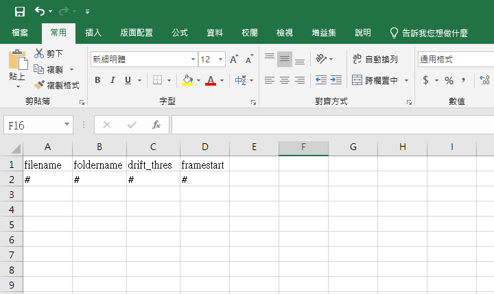

Usage
=====

Installation
------------
Blink only supports Python versions starting from 3.10.
The use of a Python virtual environment is recommended, even for Windows users.
Checkout the official `documentation <https://docs.python.org/3/library/venv.html>`_ and `tutorial <https://docs.python.org/3/tutorial/venv.html>`_
for guides to setup and activate a virtual environment.
Make sure Git is installed and on your PATH. 
For Windows users, you would also have to 
`download git <https://gitforwindows.org/>`_ and install it manually.

.. note::
   For PowerShell users, activate the virtual environment with the following 
   lines

   .. code-block:: powershell

      PS Set-ExecutionPolicy RemoteSigned
      PS <path\to\venv>\Scripts\Activate.ps1
      (venv-name) PS

   If the virtual environment is activated correctly, ``(venv-name)`` should 
   appear before the prompt.

To use Blink, firstly ``cd`` to where you want to clone the source repository.
Then, install it as the following:

.. code-block:: console

   (.venv) $ git clone https://gitlab.com/leejuyuu/blink.git
   (.venv) $ pip install --editable blink/

This makes an editable installation.

Glossary
--------
In many single molecule experiments, typically in
our lab, kinetic behavior of biomolecules is monitored by
fluorescence signals. A single observation view is called field of
view (FOV), on which labeled DNAs are detected as tiny bright
spots, called area of interest (AOI). Each AOI is recorded on
intensity of an instantaneous frame and coordinate. The results
could be analyzed in various modes, e.g. FRET calculation and
survival function plotting. Additionally, when using the package,
some MATLAB scripts are needed case by case.

.. _directory structure:

Glimpse files and directory structure
-------------------------------------
Blink currently mainly supports a binary file format that is used by `Glimpse
<https://github.com/gelles-brandeis/Glimpse>`_.
This 

.. note::
   The support for TIFF files is planned in the future.

|Directory structure|

.. note::
   It is mandatory that the Experiment result folders have **only** Channel 
   folders. Other files, such as the Excel file and \_aoi.npz, should be saved 
   outside the Experiment result folders.

Viewing images and picking spots
--------------------------------

A GUI tool is provided to view microscope images saved in Glimpse format. 
It is also used in order to construct AOIs via a spot picking process.
The image viewing GUI is started by running

.. code-block:: console

   (.venv) $ blink view-image

A file selector will show-up, the user should choose the channel folder 
containing glimpse file. 
.. xNote that
..    the folder is the *target channel* (typically, it is the
..    color of labeled DNA).

Interface introduction
^^^^^^^^^^^^^^^^^^^^^^
|Image-viewing interface|

- A: Image area. Display the loaded image and the picked AOIs. The mouse scroll
  bar can be used to zoom in/out the image. Use the mouse to drag the image to 
  view to other parts when zoomed in.   

- B: Image scale bar. Shows the histogram of pixels the current frame displayed
  in **A**. The upper bound of the blue slide bar corresponds to the image white
  level, and the lower bound corresponds to the black level. You can lower the
  upper bound to increase brightness of the image. When necessary, the lower 
  bound could also be increased to enhance contrast, but eventually the spots
  will disappear due to over truncation. 

  .. note::
     The image display scale that is adjusted here only affects the display, it
     does not alter the actual pixel values.

- C: Spot picking buttons.

  - Pick: based on the criteria in **D**, pick the AOIs in blue squares.
  - Fit: using Gaussian function, optimize the AOIs.
  - Add: add AOIs manually on the spot in **A**. Subsequent fit is suggested.
  - Remove: remove AOIs manually, which is simply the undo of add.

- D

  - AOI width: change the size of the blue square. For TIRF microscope-generated
    data, the default is 6; others are 5.
  - Spot diameter: **do not change it!**
  - Noise diameter: **do not change it!**
  - Spot brightness: set the spot-selecting criteria, below which the spots will
    be excluded.
  - Distance threshold: set the spot-selecting criteria. If the distance among
    AOIs is within this threshold, all of them will be excluded.

- E

  - Remove close AOI: based on the *Distance threshold* in **D**, remove AOIs.
  - Remove empty AOI: based on the *Spot brightness* in **D**, remove AOIs.
  - Removed occupied AOI: this is the opposite of *Remove empty AOI*
  - Save: save the information of picked AOIs
  - Load: load npz file containing the information of picked AOIs

- F
The upper left integer is the frame number, which is
changed by the sliding bar in **H**.
The text field controls how many frames you want to
average in order to attenuate the noise.
*AOI count*: the number of picked AOIs shown in **A**.

- G

  - LoadMapping: load mapping file to transpose AOIs into the other channel. The mapping matrix is displayed below the bottoms.
  - Map: based on the mapping matrix, map the AOIs into the other channel.
  - Inverse map: this is the undo of *Map*.

- H: Current frame slidebar. Controls the current frame to be displayed, and it
  can be moved by mouse or the right and left arrow keys. The current frame 
  index, which is zero-based, is displayed on the right-hand side.

Suggestions
^^^^^^^^^^^

- Avoid planting DNAs crowdedly.
- Do not pick strange-looking (not a dot) or anomalously
  bright AOIs, for example, |Bad AOI examples|
- If you need mapping, remove AOIs which are in close
  proximity to the image edge. You can ascertain yourself by
  loading the mapping file and see whether an error is raised:
  ``ValueError: Coordinates of an AOI should be positive value or 0.``

- Saving file: after picking the AOIs, click *Save* to save all
  the information into a npz file. The file name should end in
  \**_aoi**. It is suggested that the file be saved in :ref:`another
  created folder <directory structure>`.

-  Close the window

Intensity time traces calculation
---------------------------------

.. _parameter file:

First, create an Excel parameter file. This file is for finding the source 
images and enables batch processing. In the first sheet, enter the parameters 
as follows. The sheet name need not be changed.

+----------+------------+-------------+------------+
| filename | foldername | drift_thres | framestart |
+==========+============+=============+============+
| L1_01    | 01         | 20          | 1          |
+----------+------------+-------------+------------+

Like the following image
|Excel format example 1|

- filename: Filename before _aoi.npz. Should be a string.

- foldername: Experiment result folder name, see `directory structure`_.

- drift_thres: The drift correction process pick spots on each frame in the image stack
  and tries to connect them in time if they are close (in space) enough.
  The ``drift_thres`` parameter is thus set to the *Spot brightness* value that can 
  find most of the valid drift marker spots (usually DNA), 
  when frame average equals to 1.

- framestart: The starting frame number, from which the intensity is analyzed.

For example, for such directory structure
|Directory structure example|
The Excel file should look like
|Excel format example 2|

- Name the second sheet as channels. Enter the parameters as
  follows:

+-------+-----------------+
|       | map file name   |
+=======+=================+
| blue  | 20220208\_rb\_1 |
+-------+-----------------+
| green | 20220208\_rg\_5 |
+-------+-----------------+

The first column really has no meaning currently. 
The second column holds the \*.dat mapping file name, without the extension.
The mapping file name needs not to be the same format as mine, 
but should contain a substring "_xx_" to specify the direction of mapping.
The character "r", "g", and "b" corresponds to "red", "green", and "blue" channels, respectively.
For example, for a red-to-green mapping file, the name ends in *_rg_*.

For example,
|Excel format example 3|

Edit the line 47 of ``intensity_traces.py`` to change the channel name manually.
The ``target_channel`` variable is the channel to be assigned to the picked 
AOIs. It affects the later image registration process.

.. code-block:: python

   target_channel = imp.Channel("<name>", "<name>")

For example, if the AOIs were picked in *red* channel,
replace "<name>" with "red".
Make sure you do save the script.

Run the script ``src/blink/intensity_traces.py`` in the virtual environment:

.. code-block:: shell

   (.venv) $ python <path to intensity_traces.py>

Several file dialogs will pop up.
Select the specified files in the following order:
|Directory structure example 2|

.. _ebFRET:

HMM state fitting (optional, has MATLAB dependency)
^^^^^^^^^^^^^^^^^^^^^^^^^^^^^^^^^^^^^^^^^^^^^^^^^^^
1. Convert data to MATLAB format

-  Open traces_npy_to_mat.py; copy the directory of the folder
   containing \_traces.npz files to line 5:

.. code-block:: python

   datadir = Path(R'<directory>')

-  Save and run in the terminal,

   .. code-block:: shell
   
      python <absolute path of traces_npy_to_mat.py>

   \_traces.npz files are converted in to \_traces.dat files.

2. Running ebFRET
   *Make sure that you downloaded MATLAB script
   Imscroll-and-Utilities.*

- Open MATLAB, and enter the following commands:

  .. code-block:: matlab

     cd('<Imscroll-and-Utilities directory>')
     path(pathdef, genpath(cd))  % To add function files to search path

  Choose the Excel file created previously.

  .. code-block:: matlab

     [fn, fp] = uigetfile('*.xlsx')  % Open a gui file selector
     xlspath = [fp, fn]
     EB_fitting(xlspath)

  Choose the folder containing \_traces.mat files.

- The entire processing time usually takes minutes.

- *Note* Warnings like

  .. code-block:: matlab

     Warning: soft kmeans initialization of state means failed
     In init_w_hmm (line 130)
     In eb_hmm (line 230)
     In eb_fret (line 142)
     In EB_fitting (line 23)

  are normal.

- *Note* If the processing fails, check the crashdump message,
  and identify which trace is the source of problem. 
  The cause of this issue is unclear for now. My suggestion is to remove such 
  trace. You can do this by removing the corresponding AOI and recalculate the 
  intensity.

  .. code-block:: python

     path = Path('<path to the corresponding _aoi file')
     aois = imp.Aois.from_npz(path)
     aois.coords = np.delete(aois.coords, <AOI index to remove (MATLAB index - 1)>, 0)
     aois = imp.Aois.to_npz(aois, path)

- \_eb.dat files are created when the processing completes.

Trace plotting
--------------

The trace plotting GUI can be opened by the command

.. code-block:: console

   (.venv) $ blink plot-traces

A file dialog will pop-up, choose the Excel file created previously.
A prompt to confirm will appear on the terminal, enter "y" if the printed path is correct.
Another file dialog will pop-up, this time choose the folder containing the _aoi.npz files.

Interface introduction
^^^^^^^^^^^^^^^^^^^^^^
|Trace plotter interface|

- A: Display the intensity or FRET time trace(s).
  In intensity mode, each subplot corresponds to intensity of one of the channels you have recorded.
  The time traces will be colored according to the channel color.
  When a :ref:`viterbi state sequence <ebFRET>` is available, 
  an additional black line for the state means will be shown on the plot.

- B

  - Sheet name: the sheet name of the Excel `parameter file`_.
  - Field of view: correspond to each row of the Excel `parameter file`_.
    The names correspond to the filename parameter.
  - Molecule: the index of each trace.
  - Category: analyzable or none, in response to
    analyzable in C.

- C

  - previous and next: Goto the previous trace or the next trace, respectively. 
    You can also use the left and right arrow keys, respectively.
  - save: Plot and save the current plot in A using matplotlib, using the ``trace_style.mplstyle`` style file.
  - analyzable: Click to label the current trace as *analyzable*.
    A <>_category.npy file will be saved in the data directory after the user changes the current viewing molecule, FOV, or sheet. 
    The file also saves after the user closes the window. 
    This file stores boolean 1D arrays with the length being the number of molecule,
    and ``True`` corresponds to *analyzable*.
  - discard: The undo of the analyzable button.
  - AOI image: Load Experiment result folder to view
    recorded image (for colocalization).
  - The text field is used to adjust the moving average window size for signal smoothing.

When completed, close the window. 

Survival function plotting (for photobleaching analysis) 
--------------------------------------------------------

Edit line 10-12 of ``script_photobleaching_dwell_time_exp.py`` according to your data

.. code-block:: python

   datapath = Path('<the folder containing _aoi files>')
   parameter_file_path = Path('<the Excel parameter file path>')
   sheet = '<sheet name of the parameter file to analyze>'

This script combines all the dwell-time data from **all the rows** in the specified sheet.
Therefore, split different conditions into different sheets so that you will not accidentally mix the data.

Run the script. Two files (*sheet_name*\_pb.npz and *sheet_name*\_pb.svg) will be saved in *datapath*. 
The svg file is the survival plot.
It contains a step line, which is the Kaplan-Meier estimate of the survival curve,
and a smooth line, which is the esitimate of the survival curve under the assumption of a exponential model.
The npz file stores the estimated survival curve, the estimated exponential parameter, and their confidence intervals.

Combining survival function plots (optional)
^^^^^^^^^^^^^^^^^^^^^^^^^^^^^^^^^^^^^^^^^^^^

Edit ``script_combine_survival_plots.py`` acoording to your data

.. code-block:: python

   # You can define your own mplstyle
   plt.style.use(str(Path('<path of fig_style.mplstyle>').resolve()))
   datapath = Path('<folder containing _pb files>')
   filestr = ['<the string before _pb files>']
   labels = ['<desired legend labels>'] # line 19

.. 
   TODO: The temp.svg file name is too silly.

Run the script. Then, ``temp.svg`` file will be generated. 

